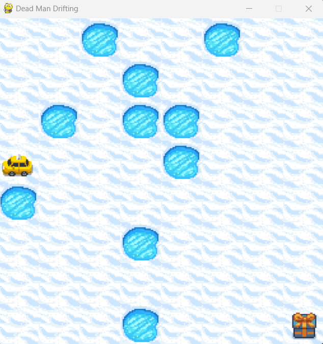
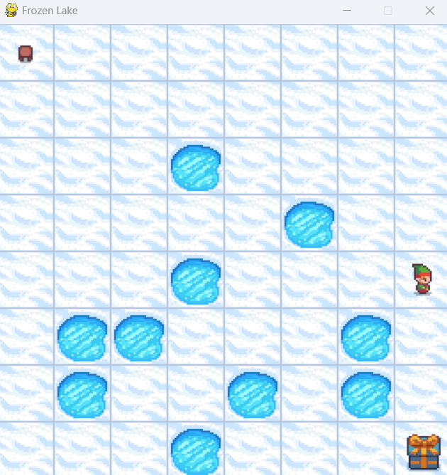

# Slippery-Paths-AI

This project implements a Markov Decision Process (MDP) to navigate an agent (taxi/elf) in the Frozen Lake environment. The agent is trained to find the optimal policy to reach its destination while considering the probabilistic effects of actions on a slippery grid.

  

## Features
- **Environment:** FrozenLake-v1 (Gymnasium library) with an 8x8 map.
- **Algorithm:** Policy Iteration with Policy Evaluation and Policy Improvement steps.
- **Goal:** The agent learns an optimal policy to navigate from the start to the goal state efficiently.

## Process
1. **Policy Evaluation:** Compute the value of each state based on the current policy.
2. **Policy Improvement:** Derive a new policy by maximizing the Q-values of states.
3. **Simulation:** Use the optimal policy to simulate the agent's navigation in the environment.

  

## Visualization

### 1. **Initial Environment State**
The Frozen Lake environment is initialized with the agent at the starting position.

### 2. **Value Function Convergence**
The value function iteratively converges as part of the policy evaluation process.

### 3. **Optimal Policy in Action**
The agent follows the optimal policy to navigate the environment successfully.

## Output
The script displays:
- The **Optimal Policy** as an 8x8 grid.
- The **Optimal Value Function**.
